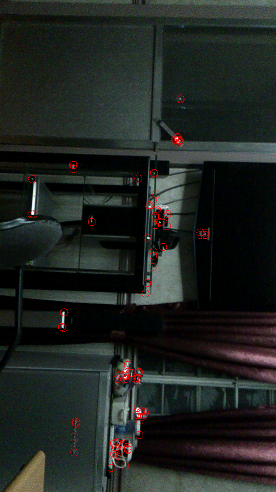

# OpenCV Mixed-signal Processing

opencvmixedsignalprocessing-rohit0000 created by Classroom for GitHub

This project illustrates OpenCV Mixed-signal Processing, i.e Native and Java, in Android Studio.

##Screenshot

